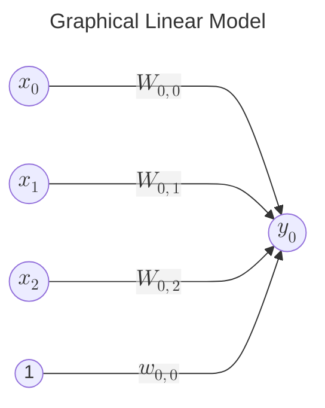
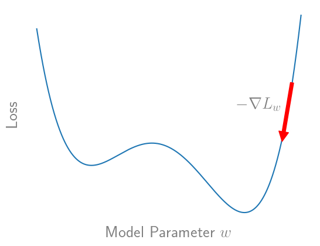

# Baby's First Neural Network

We will start by deriving a simple linear regression model with weights found via gradient descent. We will then extend the theory to formulate a multi-layer perceptron trained with stochastic gradient descent. There are exercises to track your understanding throughout these notes. There is an answer key at the bottom of the page, but it is advised that you attempt to work out the problems on your own first.

## Preliminaries: Linear Regression via Gradient Descent

Let $x \in\rm I\!R^m,\ y \in\rm I\!R^n$ be $m$ and $n$ dimensional vectors forming an input-output pair of data. Let $D=\{(x,y)_i\}_{i=0}^N$ be a dataset of $N$ input-output pairs. For now let's assume that the relationship between $x$ and $y$ can be modeled by the affine matrix equation

$$\hat y(x) = W^Tx+w_0$$

where $W \in\rm I\!R^{m \times n},\ w_0 \in\rm I\!R^n$ are weight vectors such that $\hat y_i(x) = W_i^Tx+w_{0,i}$ represents the $i$th element of $\hat y(x)$. We can express this relation graphically by representing each input and output as a node, and each edge between them a weighted connection. Let's look at a specific example for a linear model with three inputs and one output:

which can be expressed algebraically as

$$\begin{align*}\hat y_0(x)&=W_{0,0}x_0+W_{0,1}x_1+W_{0,2}x_2+w_{0,0}\\ &=W_0^Tx+w_{0,0}\end{align*}$$

as expected. To quantify the fit of the model to the observed data $D$ we define a loss function 

$$L(y, \hat y)=\frac{1}{N}\sum_i^N||y(x_i)-\hat y(x_i)||^2_2$$

via mean squared error and the $L_2$ norm. This gives us a training objective 

$$\min_{W,w_0}L(y,W^Tx+w_0)\quad \forall (x,y)\in D.$$

With only slight abuse of notation, the optimal weights can be found analytically as $\widetilde W=(X^TX)^{-1}X^TY$ where $X,Y=\begin{bmatrix}\{(\widetilde x,y)_i\}_{i=0}^N\end{bmatrix}$ and we augment $x$ and $W$ as $\widetilde x = \begin{bmatrix}x^T\ 1\end{bmatrix}^T\in\rm I\!R^{m+1},\ \widetilde W = \begin{bmatrix}W^T\ w_0\end{bmatrix}^T\in\rm I\!R^{m+1 \times n}$ to represent the affine map as a linear map, i.e. $\hat y(x)=\widetilde W^T\widetilde x$. However, we will not use this approach, as finding the analytical solution for large $N$ (or $m$, or $n$) may be infeasible, and, more importantly, when we extend our linear regression model to a neural network, this approach will prove to be intractable.

Instead, we will use an iterative algorithm called "gradient descent" to numerically approximate the optimal values of $W$ and $w_0$. We start by initializing $W$ and $w_0$ with random weights sampled from $\mathcal{N}(0,\frac{1}{m})$. Then, the weights are iteratively updated via the update rules:

$$W^{(t+1)} = W^{(t)} - \eta\nabla L_{W^{(t)}}$$
$$w_0^{(t+1)} = w_0^{(t)} - \eta\nabla L_{w_0^{(t)}}$$

where $\eta$ is the learning rate and $\nabla L_{w^{(t-1)}}$ is the gradient of the loss with respect to the weight $w$ evaluated at iteration $t$. Geometrically, this update rule can be interpreted as taking a step "down" the gradient in the direction of decreasing loss. 

Intuitively, $\nabla L_{w^{(t-1)}}$ represents to what degree the value of $w$ contributed to the loss, and so adjusting the weight in the direction of decreasing loss will result in lower loss on the next iteration. Note that the size of the step is determined by the learning rate. In practice the learning rate must be determined empirically. If $\eta$ is too large then the weight update may overshoot the local minima and lead to divergence. Conversely, if $\eta$ is too small we may never achieve convergence in reasonable time. We will explore these trade-offs later in this exercise. We can find $\nabla L_w$ via the chain rule. In the 1D case this can be clearly expressed as:

$$\frac{\partial L}{\partial w}=\frac{\partial L}{\partial\hat y}\frac{\partial\hat y}{\partial w}$$
$$\frac{\partial L}{\partial w_0}=\frac{\partial L}{\partial\hat y}\frac{\partial\hat y}{\partial w_0}$$

## Exercise 1: Gradient Descent for a Linear Regression Model

We now have the tools to derive the weight update for the linear model explicitly. For this exercise only consider the loss for a single input-output pair, i.e. $L(y,\hat y)=||y(x)-\hat y(x)||^2_2 \in\rm I\!R$. Find each expression for the general case of an $m$ dimensional input and an $n$ dimensional output. It may be helpful to first find the shape of each quantity. Refer to the notes on [notation](notation.md) if you need a refresher on matrix- and vector-valued derivatives.

1.a) $\nabla L_{\hat y}=$

1.b) $\nabla \hat y_W=$

1.c) $\nabla \hat y_{w_0}=$

1.d) $\nabla L_W=$

1.e) $\nabla L_{w_0}=$

Note that $\hat y$ is only guaranteed to converge to a local optimum via SGD if $\eta=\eta(t)$ decays as a function of time. Specifically:

$$\sum_{t=1}^\infty \eta(t)=\infty, \quad \sum_{t=1}^\infty \eta(t)^2\lt\infty$$

must hold. An example function that satisfies the above properties is $\eta(t)=\frac{1}{t}$, however functions that decay more slowly are often selected due to their better empirical performance and numerical stability. In practice a small constant (e.g. $0.001$) is often used, despite violating the above assumptions.

## Answer Key

1.a) $-2(y-\hat y)\in\rm I\!R^n$

1.b) $\begin{bmatrix}x^T &  &  &   \\&  x^T&  &  \\&  & \ddots  &  \\&  &  & x^T\end{bmatrix}\in\rm I\!R^{n\times mn}$ or, equivalently, $x^T\in\rm I\!R^m$

1.c) $I\in\rm I\!R^{n\times n}$

1.d) $\nabla L_{\hat y}\nabla\hat y_W=-2(y-\hat y)x^T\in\rm I\!R^{n\times m}$

1.e) $\nabla L_{\hat y}\nabla\hat y_{w_0}=-2(y-\hat y)\in\rm I\!R^n$